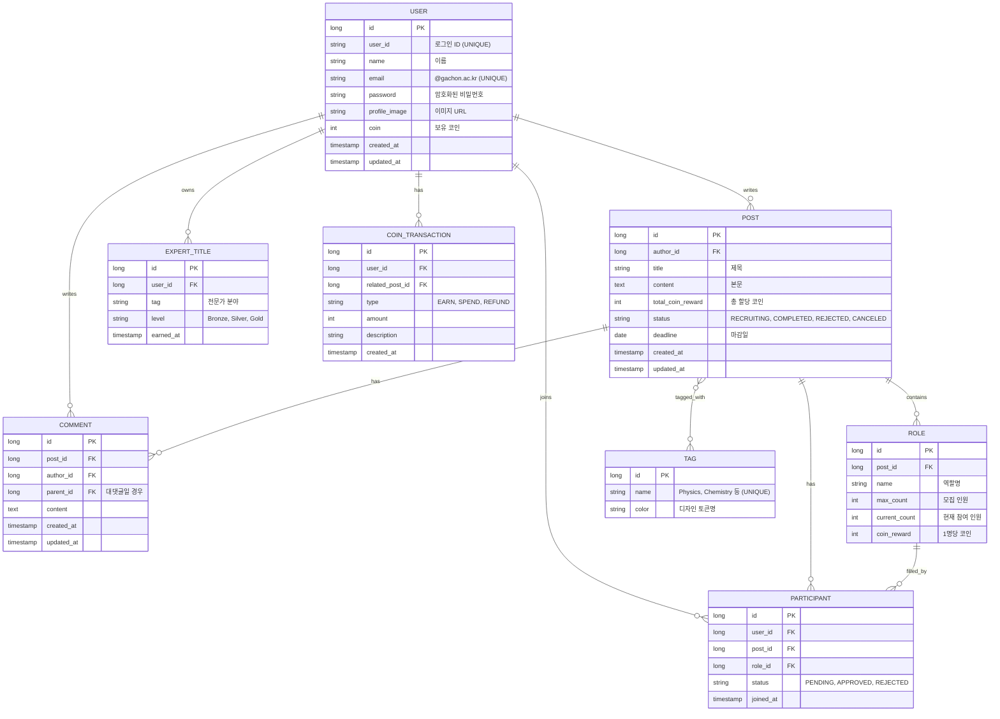

# ERD 설계 명세서 (ERD Specification)

가천 코인 시스템의 영속성 계층 데이터베이스 설계입니다. 백엔드 팀과의 협업을 위한 참고용 문서입니다.

## 1. ER Diagram (Mermaid)

## 2. 테이블 상세 명세

### 2.1 USER (사용자)
- 가천대 학생 계정 정보를 관리합니다.
- `email`은 `@gachon.ac.kr` 도메인만 허용 (CHECK 제약).
- `coin` 컬럼은 거래 트랜잭션과 동기화 (음수 불가).

### 2.2 POST (게시물)
- 모집글의 기본 정보 및 상태를 관리합니다.
- 상태별 코인 처리 로직은 `scenarios.md` 5번 항목 참조.

### 2.3 ROLE (역할)
- 게시물 내 모집 역할과 인원, 보상 코인을 관리합니다.
- `current_count`는 `PARTICIPANT` 테이블의 `APPROVED` 상태 카운트와 동기화.

### 2.4 PARTICIPANT (참여자)
- 사용자의 게시물 참여 신청 및 상태를 관리합니다.
- `status` PENDING → APPROVED/REJECTED 흐름.

### 2.5 COMMENT (댓글)
- `parent_id`가 NULL이면 일반 댓글, 값이 있으면 대댓글.
- 대댓글의 대댓글은 허용하지 않음 (depth=1 제한).

### 2.6 TAG (분류 태그)
- Physics, Chemistry, Maths, Programming, Language 등 사전 정의된 태그.
- `color`는 `DESIGN.md`의 태그 컬러 토큰명과 매칭.

### 2.7 EXPERT_TITLE (전문가 타이틀)
- 사용자가 특정 분야에서 일정 활동 이상을 누적하면 자동 부여.
- 한 사용자가 여러 태그의 타이틀 보유 가능 (다중).

### 2.8 COIN_TRANSACTION (코인 거래 내역)
- 모든 코인 변동 내역을 기록 (감사 및 통계용).
- 게시물 작성 시 SPEND, 완료 시 EARN, 반려/취소 시 REFUND.
